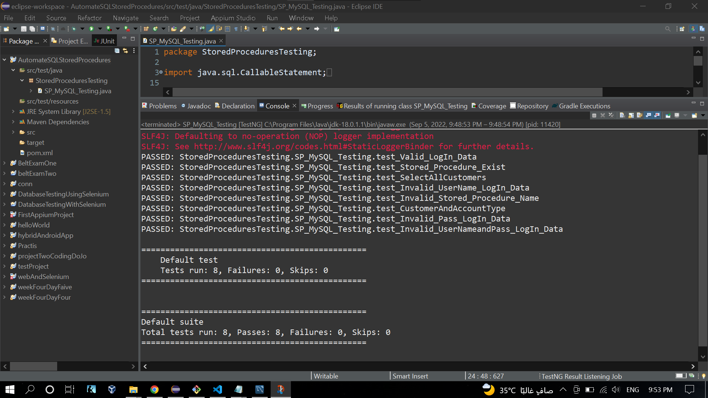

## Automate SQL Stored Procedures (Using TestNG Framework - JDBC)

- Download and Run Eclipse.
- Create a new Maven project.
    - From the File menu, select New > Project.
    - The New Project screen opens.
    - Expand Maven, select Maven Project, and click Next.
    - The New Maven project wizard opens.
    - Select Create a simple project, and Click Next

</br>

- Enter Group ID and Artifact ID

</br>
</br>

- In `\src\test\java` Create a new Packege, `StoredProceduresTesting`
- In `pom.xml` Add Dependency >
    - Go to https://mvnrepository.com/
    - Search For `MySql`, `lang3` and `TestNG`, Click on the latest version, Copy the Dependency, and Paste it inside `<dependencies></dependencies>` Tag.

</br>

- Create a class `SP_MySQL_Testing`, In the `StoredProceduresTesting` Packege.
- Create the Test Cases.

## `SP_MySQL_Testing.java` File:

```java
package StoredProceduresTesting;

import java.sql.CallableStatement;
import java.sql.Connection;
import java.sql.DriverManager;
import java.sql.ResultSet;
import java.sql.SQLException;
import java.sql.Statement;

import org.apache.commons.lang3.StringUtils;
import org.testng.Assert;
import org.testng.annotations.AfterClass;
import org.testng.annotations.BeforeClass;
import org.testng.annotations.Test;

public class SP_MySQL_Testing {
	Connection con = null;
	Statement stmt = null;
	ResultSet rs;
	ResultSet rs1;
	ResultSet rs2;
	CallableStatement cStmt;

	// Establish the connection to the database
	@BeforeClass
	void db_setup() throws SQLException {
		// root is the user name
		// 1234 is the password
		con = DriverManager.getConnection("jdbc:mysql://localhost:3306/dbbankmanagement", "root", "1234");
	}

	// Close Database Connection
	@AfterClass
	void close_db_connection() throws SQLException {
		con.close();
	}

	// TC_29: Check Stored Procedure `LogIn()` exist in the Database.
	@Test(priority = 1)
	void test_Stored_Procedure_Exist() throws SQLException {
		stmt = con.createStatement();
		rs = stmt.executeQuery("SHOW PROCEDURE STATUS WHERE NAME = 'LogIn'");
		rs.next();
		// Compare the value in "Name" Column, and "LogIn", If they are
		// equal or not.
		Assert.assertEquals(rs.getString("Name"), "LogIn");

	}

	// TC_30: Check Stored Procedure `SelectAllCustomers`, If Returns all Customers.
	@Test(priority = 2)
	void test_SelectAllCustomers() throws SQLException {
		cStmt = con.prepareCall("{CALL SelectAllCustomers()}");
		rs1 = cStmt.executeQuery();

		Statement stmt = con.createStatement();
		rs2 = stmt.executeQuery("SELECT * FROM customer");

		Assert.assertEquals(compareResults(rs1, rs2), true);
	}

	// TC_31: Check Stored Procedure `CustomerAndAccountType`, If Returns the same
	// Test Query.
	@Test(priority = 3)
	void test_CustomerAndAccountType() throws SQLException {
		cStmt = con.prepareCall("{CALL CustomerAndAccountType(?)}");
		cStmt.setString(1, "Closed");
		rs1 = cStmt.executeQuery();

		Statement stmt = con.createStatement();
		rs2 = stmt.executeQuery(
				"SELECT customer.CustomerFirstName, customer.City, customer.AccountID, account.CurrentBalance\r\n"
						+ ", accountstatustype.AccountStatusTypeDescription, accounttype.AccountTypeDescription FROM customer \r\n"
						+ "JOIN customeraccount ON customer.CustomerID = customeraccount.CustomerID\r\n"
						+ "JOIN account ON customeraccount.AccountID = account.AccountID\r\n"
						+ "JOIN accountstatustype ON accountstatustype.AccountStatusTypeID = account.AccountStatusTypeID\r\n"
						+ "JOIN accounttype ON accounttype.AccountTypeID = account.AccountTypeID\r\n"
						+ "WHERE accountstatustype.AccountStatusTypeDescription = 'Closed'");

		Assert.assertEquals(compareResults(rs1, rs2), true);
	}

	// TC_32: Check Stored Procedure `LogIn`, If Returns the same Test Query table,
	// Valid username and password.
	@Test(priority = 4)
	void test_Valid_LogIn_Data() throws SQLException {
		cStmt = con.prepareCall("{CALL LogIn(?,?)}");
		cStmt.setString(1, "User3");
		cStmt.setString(2, "Pass3");
		rs1 = cStmt.executeQuery();

		Statement stmt = con.createStatement();
		rs2 = stmt.executeQuery(
				"SELECT userlogins.UserLoginID, customer.SSN, customer.CustomerFirstName, customer.CustomerLastName\r\n"
						+ ", transactionlog.TransactionAmount, transactionlog.TransactionDate\r\n"
						+ ", transactiontype.TransactionTypeName, transactiontype.TransactionTypeDescription\r\n"
						+ "FROM userlogins\r\n"
						+ "Join transactionlog ON transactionlog.UserLoginID = userlogins.UserLoginID\r\n"
						+ "Join transactiontype ON transactiontype.TransactionTypeID = transactionlog.TransactionTypeID\r\n"
						+ "Join customer ON customer.CustomerID = transactionlog.CustomerID\r\n"
						+ "WHERE UserLogin='User3' AND UserPassword='Pass3'");

		Assert.assertEquals(compareResults(rs1, rs2), true);
	}

	// TC_33: Check Stored Procedure `LogIn`, Enter an Invalid Username and valid
	// password.
	@Test(priority = 5)
	void test_Invalid_UserName_LogIn_Data() throws SQLException {
		cStmt = con.prepareCall("{CALL LogIn(?,?)}");
		cStmt.setString(1, "InvalidUsername");
		cStmt.setString(2, "Pass3");
		rs1 = cStmt.executeQuery();
		rs1.next();
		String errorMsg = "User authentication failed, Invalid User Name/Password";

		Assert.assertEquals(rs1.getString("falseResult"), errorMsg);
	}

	// TC_34: Check Stored Procedure `LogIn`, Enter a valid Username and Invalid
	// password.
	@Test(priority = 6)
	void test_Invalid_Pass_LogIn_Data() throws SQLException {
		cStmt = con.prepareCall("{CALL LogIn(?,?)}");
		cStmt.setString(1, "User3");
		cStmt.setString(2, "InvalidPass");
		rs1 = cStmt.executeQuery();
		rs1.next();
		String errorMsg = "User authentication failed, Invalid User Name/Password";

		Assert.assertEquals(rs1.getString("falseResult"), errorMsg);
	}

	// TC_35: Check Stored Procedure `LogIn`, Enter an Invalid Username and
	// password.
	@Test(priority = 7)
	void test_Invalid_UserNameandPass_LogIn_Data() throws SQLException {
		cStmt = con.prepareCall("{CALL LogIn(?,?)}");
		cStmt.setString(1, "InvalidUsername");
		cStmt.setString(2, "InvalidPass");
		rs1 = cStmt.executeQuery();
		rs1.next();
		String errorMsg = "User authentication failed, Invalid User Name/Password";

		Assert.assertEquals(rs1.getString("falseResult"), errorMsg);
	}

	// TC_36: Call Invalid Stored Procedure Name.
	@Test(priority = 8)
	void test_Invalid_Stored_Procedure_Name() throws SQLException {
		stmt = con.createStatement();
		rs = stmt.executeQuery("SHOW PROCEDURE STATUS WHERE NAME = 'UnavailableStoredProcedure'");
		rs.next();
		boolean invalidStoredProcedureRow = rs.next();
		Assert.assertFalse(invalidStoredProcedureRow);
	}

	// The method compares two tables and returns a boolean value.
	// Input: Two parameters, ResultSet
	// Output: Boolean value
	public boolean compareResults(ResultSet resultSet1, ResultSet resultSet2) throws SQLException {
		while (resultSet1.next()) {

			resultSet2.next();

			int count = resultSet1.getMetaData().getColumnCount();
			for (int i = 1; i <= count; i++) {
				if (!StringUtils.equals(resultSet1.getString(i), resultSet2.getString(i))) {
					return false;
				}
			}
		}
		return true;
	}
}
```

## `pom.xml` File:

```xml
<project xmlns="http://maven.apache.org/POM/4.0.0" xmlns:xsi="http://www.w3.org/2001/XMLSchema-instance" xsi:schemaLocation="http://maven.apache.org/POM/4.0.0 https://maven.apache.org/xsd/maven-4.0.0.xsd">
	<modelVersion>4.0.0</modelVersion>
	<groupId>AutomateSQLStoredProcedures</groupId>
	<artifactId>AutomateSQLStoredProcedures</artifactId>
	<version>0.0.1-SNAPSHOT</version>
	<dependencies>
		<!-- https://mvnrepository.com/artifact/mysql/mysql-connector-java -->
		<dependency>
			<groupId>mysql</groupId>
			<artifactId>mysql-connector-java</artifactId>
			<version>8.0.30</version>
		</dependency>
		<!-- https://mvnrepository.com/artifact/org.testng/testng -->
		<dependency>
			<groupId>org.testng</groupId>
			<artifactId>testng</artifactId>
			<version>7.6.1</version>
			<scope>test</scope>
		</dependency>
		<!-- https://mvnrepository.com/artifact/org.apache.commons/commons-lang3 -->
		<dependency>
			<groupId>org.apache.commons</groupId>
			<artifactId>commons-lang3</artifactId>
			<version>3.12.0</version>
		</dependency>
	</dependencies>
</project>
```

## Result - Images and Video:

</br>
</br>

<a href='https://youtu.be/S1qJr84vlAg'>Recorded video, while Automated testing running</a>