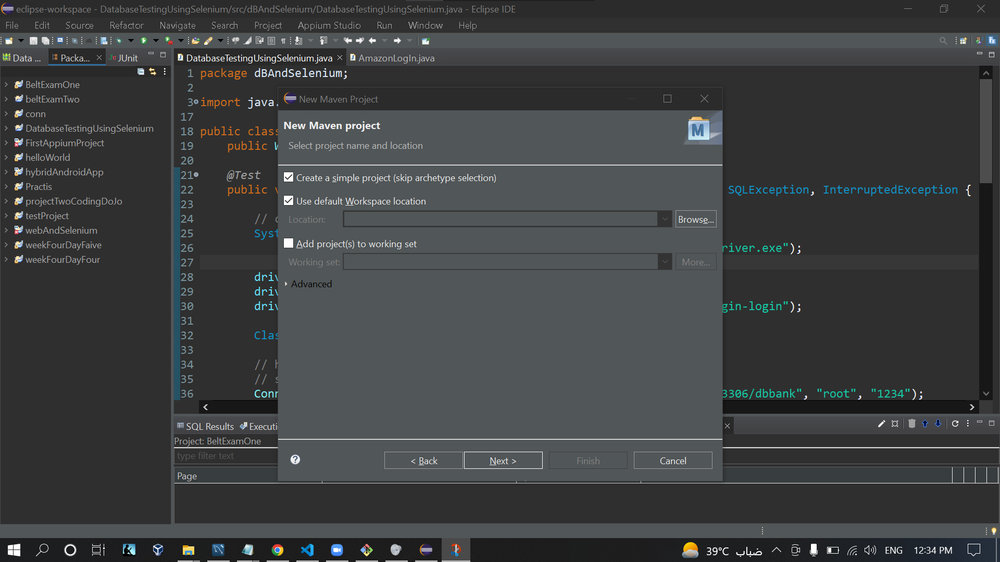
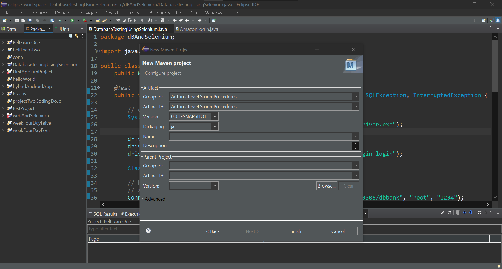
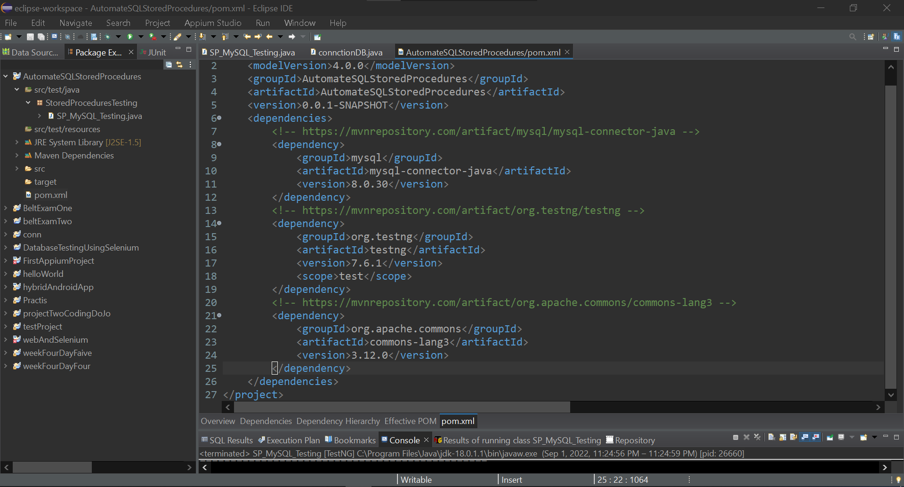

## Automate SQL Stored Procedures (Using TestNG Framework - JDBC)

- Download and Run Eclipse.
- Create a new Maven project.
    - From the File menu, select New > Project.
    - The New Project screen opens.
    - Expand Maven, select Maven Project, and click Next.
    - The New Maven project wizard opens.
    - Select Create a simple project, and Click Next

 

- Enter Group ID and Artifact ID

 
 

- In `\src\test\java` Create a new Packege, `StoredProceduresTesting`
- In `pom.xml` Add Dependency >
    - Go to https://mvnrepository.com/
    - Search For `MySql`, `lang3` and `TestNG`, Click on the latest version, Copy the Dependency, and Paste it inside `<dependencies></dependencies>` Tag.

 

- Create a `TestNG` class `SP_MySQL_Testing`, In the `StoredProceduresTesting` Packege.
- Create the Test Cases.
