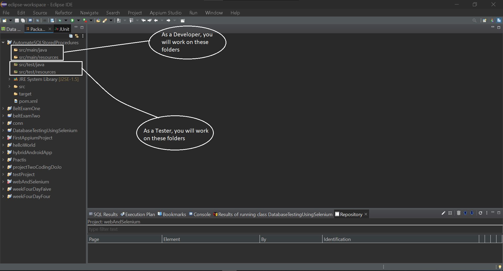

## Automate SQL Stored Procedures (Using TestNG Framework)

- Download and Run Eclipse.
- Create a new Maven project.
    - From the File menu, select New > Project.
    - The New Project screen opens.
    - Expand Maven, select Maven Project, and click Next.
    - The New Maven project wizard opens.
    - Select Create a simple project, and Click Next

 

- Enter Group ID and Artifact ID

 
 