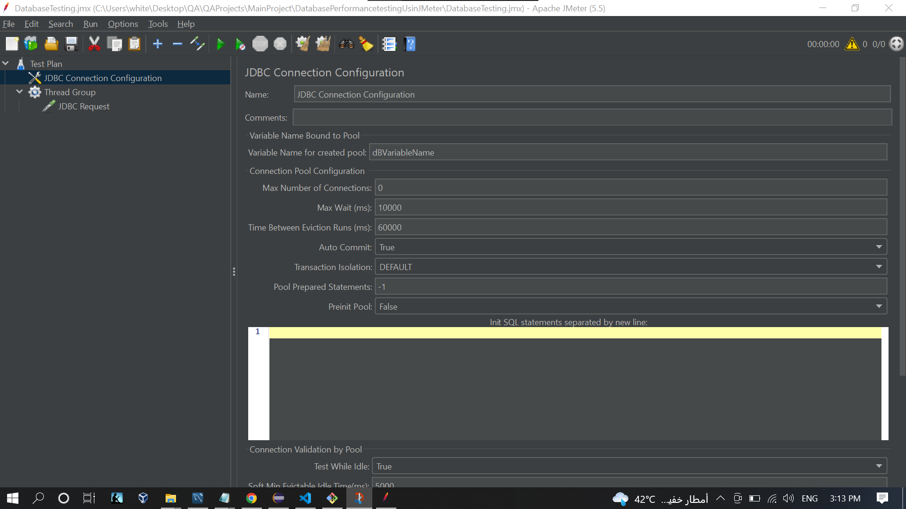

## Database Performance Testing
### Test Database server using JMeter:

- Download and install `MySQL` Free Community Edition.
- Download `apache jmeter`.
- Create a Database from <a href='../DbBankManagment-MySQL.sql'>Here</a>
- <b>Prerequisite:</b>
- From your Database you need:
    - Database Name: `dbbankmanagement`
    - Server Name: `localhost`
    - Port number: `3306`
    - User Name: `root`
    - Password: `XXXX` >> My Password :) 
    - Add `mySQL Connector` Jar file to `lib` folder of Jmeter.
    - https://dev.mysql.com/downloads/connector/j/8.0.html
    - Platform Independent > Download the ZIP File
- Unzip `apache-jmeter-5.5` Go to `bin` and Double Click on `jmeter` type `Windows Batch File`

  
  

- Right Click on `Test Plan` > `Add` > `Thread Group` 
- Save `DatabaseTesting.jmx`
- Add `mySQL Connector` Jar file to `lib` folder of JMeter.

 

- Restart JMeter.

## Database testing JMeter:

### Step 1: Make Connection with Database

- Go To `JMeter`.
- Right Click on `Test Plan` > `Add` > `Config Element` > `JDBC Connection Configuration` : To Configure JMeter Connection with the Database.
- Inside `Database Connection Configuration`:
	- Database URL: `jdbc:mysql://localhost:3306/dbbankmanagement`.
	- JDBC Driver class: `com.mysql.jdbc.Driver` >> Becose I'm Using MySQL Server.
	- Username: `root`.
	- Password: `XXXX`.
- You Can change `Connection Pool Configuration` and `Connection Validation by Pool`, But I'll keep it with the default values.
- Provide a variable Name, Inside Variable Name for created pool: `dBVariableName`.

 
 
### Step 2: Write SQL Query

### Step 3: Execute the Test

