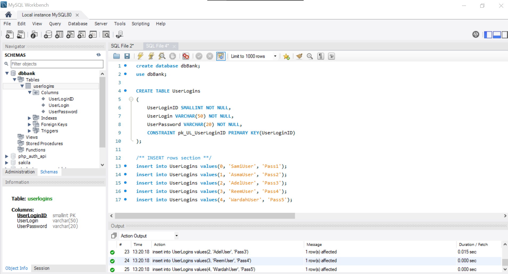

## Database Testing using Selenium:

### How to set up the testing environment:
- Open `MySQL Workbench`.
- Create `dbBank` DataBase.
- Create `UserLogins` Table.
- Insert the values into the Table.
