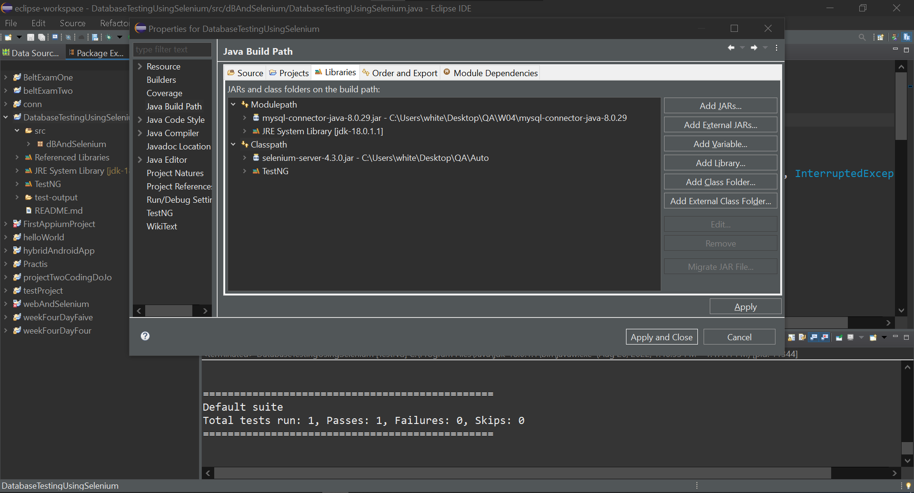
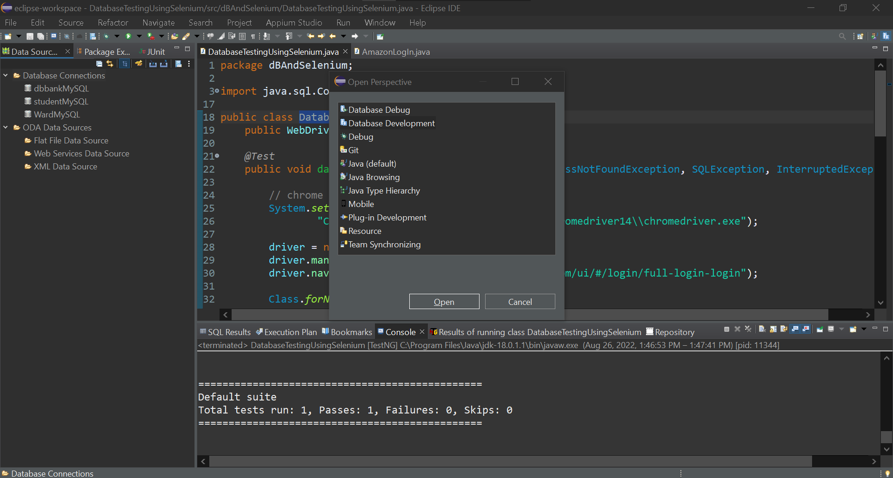
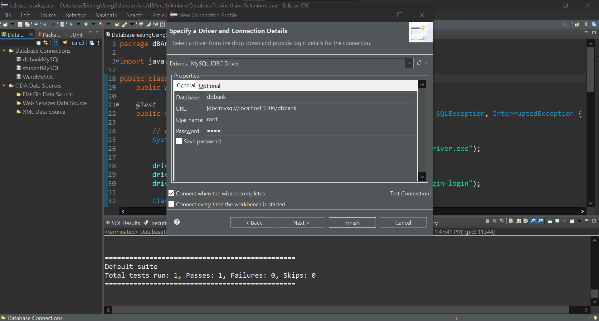

## Database Testing using Selenium:

### How to set up the testing environment:
- Open `MySQL Workbench`.
- Create `dbBank` DataBase.
- Create `UserLogins` Table.
- Insert the values into the Table.
```sql

create database dbBank;
use dbBank;

CREATE TABLE UserLogins
(
	UserLoginID SMALLINT NOT NULL,
	UserLogin VARCHAR(50) NOT NULL,
	UserPassword VARCHAR(20) NOT NULL,
	CONSTRAINT pk_UL_UserLoginID PRIMARY KEY(UserLoginID)
);

/** INSERT rows section **/
insert into UserLogins values(0, 'SamiUser', 'Pass1');
insert into UserLogins values(1, 'AsmaUser', 'Pass2');
insert into UserLogins values(2, 'AdelUser', 'Pass3');
insert into UserLogins values(3, 'ReemUser', 'Pass4');
insert into UserLogins values(4, 'WardahUser', 'Pass5');
```
<br/>

- Open Eclipse.
- Create a new project `DatabaseTestingUsingSelenium`.
- Create a new package > Create a new Class `DatabaseTestingUsingSelenium`.
- You can Download `mysql-connector-java-X.X.XX.jar` jar file from here: https://dev.mysql.com/downloads/connector/j/ , Choose `Platform Independent` and download the ZIP folder.
- Click on Modulepath > Click on Add External JARs, and choose `mysql-connector-java-X.X.XX.jar`, the jar file from your device.
- You can Download `selenium-server-X.X.X.jar` file from here: https://www.selenium.dev/downloads/
- Click on Classpath > Click on Add External JARs, and choose `selenium-server-X.X.X.jar`,the jar file from your device.
- Click on Classpath > Add Library > TestNG > Next > Finish.
- Click on `Apply and Close`.<br/>
<br/>

### Connect MySQL Database in Eclipse IDE
- From Window > Perspective > Open Perspective > Other.
- Choose Database Development.
<br/>

- Will Show `Database Connections` on the left side.
- Right Click on `Database Connections` > New > MySQL.
- Change the Name and Description > Click on Next.
- Next to `Drivers` drop-down > Click on New driver Definition > Choose The latest JDBC > from JAR List > Delete the exist jar file > and Click on Add JAR/Zip > Choose `mysql-connector-java-X.X.XX.jar`,  that you lately just download it from this site: https://dev.mysql.com/downloads/connector/j/
- Click Ok
- Click on Test Connection
- Next > Finsh
- Edit the Database Name, DB Server Username, and Password, Click on Test Connection

### Useful Resource: How to Connect MySQL Database in Eclipse IDE <a href='https://youtu.be/t6NQtfokZr8'>Video</a>
<br/>

- In the `DatabaseTestingUsingSelenium` Class, write the Testing cases:

```java
package dBAndSelenium;

import java.sql.Connection;
import java.sql.DriverManager;
import java.sql.ResultSet;
import java.sql.SQLException;
import java.sql.Statement;
import java.time.Duration;

import org.openqa.selenium.By;
import org.openqa.selenium.WebDriver;
import org.openqa.selenium.WebElement;
import org.openqa.selenium.chrome.ChromeDriver;
import org.openqa.selenium.support.ui.ExpectedConditions;
import org.openqa.selenium.support.ui.WebDriverWait;
import org.testng.annotations.Test;

public class DatabaseTestingUsingSelenium {
	public WebDriver driver;

	@Test
	public void databaseTestingUsingSelenium() throws ClassNotFoundException, SQLException, InterruptedException {

		// chrome driver path
		System.setProperty("webdriver.chrome.driver",
				"C:\\Users\\white\\Desktop\\QA\\Auto\\chromedriver14\\chromedriver.exe");

		driver = new ChromeDriver();
		driver.manage().window().maximize();
		driver.navigate().to("https://new.alahlionline.com/ui/#/login/full-login-login");

		Class.forName("com.mysql.cj.jdbc.Driver");

		// here dbbank is the database name, root is serverName and 1234 is
		// serverPassword
		Connection con = DriverManager.getConnection("jdbc:mysql://localhost:3306/dbbank", "root", "1234");
		Statement stmt = con.createStatement();

		// Select all rows in userlogins table
		ResultSet rs = stmt.executeQuery("select * from userlogins");

		// Read every row
		while (rs.next()) {

			// Declare a variable and assign to it the value of the column in the
			// `userlogins` tabel
			String userName = rs.getString(2);
			String userPassword = rs.getString(3);

			WebElement userElement = (new WebDriverWait(driver, Duration.ofSeconds(100)))
					.until(ExpectedConditions.elementToBeClickable(By.id("login-username")));

			userElement.sendKeys(userName);
			Thread.sleep(1000);

			WebElement passwordElement = driver.findElement(By.id("login-password"));
			passwordElement.sendKeys(userPassword);
			Thread.sleep(1000);

			WebElement buttonElement = driver.findElement(By.xpath("//*[@buttonid='button-login1']"));
			buttonElement.click();
			Thread.sleep(1000);

			// Clear the input value
			userElement.clear();
			passwordElement.clear();

			// Refresh the page
			driver.navigate().refresh();
			Thread.sleep(1000);

		}
		// Close the database connection
		con.close();
		// close the chrome page
		driver.close();

	}

}

```
<br/>

## Test Result: 
### <a href='https://youtu.be/2zU3O7a6loY'>Recorded video, while Automated testing running</a><br/>
