### Continuous integration: Integrate Jenkins With Selenium WebDriver 
### I'll use <a href='../DatabaseTestingUsingSelenium'>This Project</a>, to Integrate Jenkins With it.
### Setup Jenkins:
- Setup Jenkins in your local Machine
    - Download and Install Jenkins, https://www.jenkins.io/download/
    - Open `CMD`
    - Run `Java -version`, to check if java is Installed Successfully.
    - Run `java -jar jenkins.war`
    - If you are getting any errors try this command: `java -jar jenkins.war --enable-future-java --httpPort=9090`
    - Save the password.

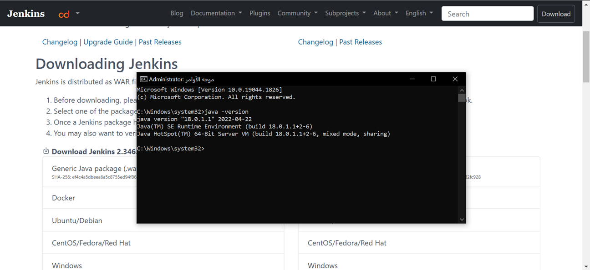</br>

- Open the browser: http://localhost:9090/
- Enter the password and click continue

</br>

- Click Install Suggested plugins

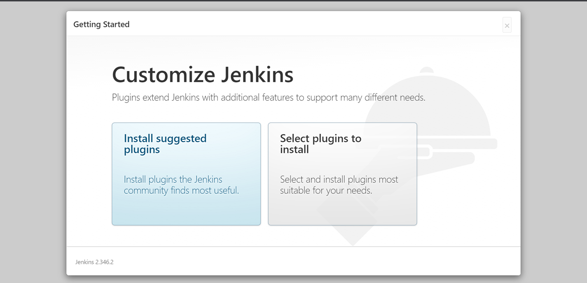</br>

- Fill in the Details

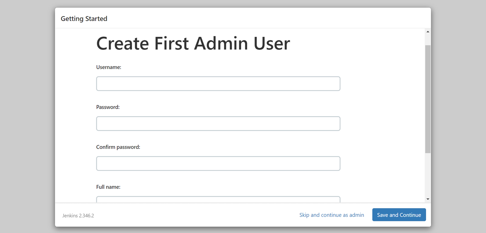</br>
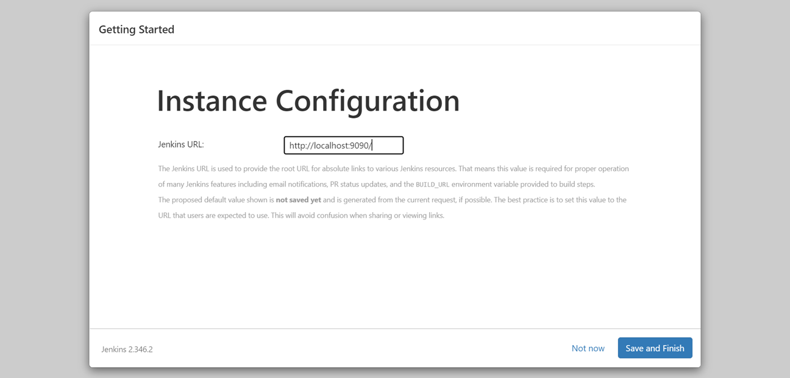</br>
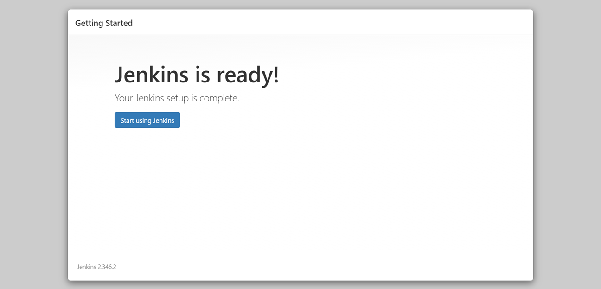</br>
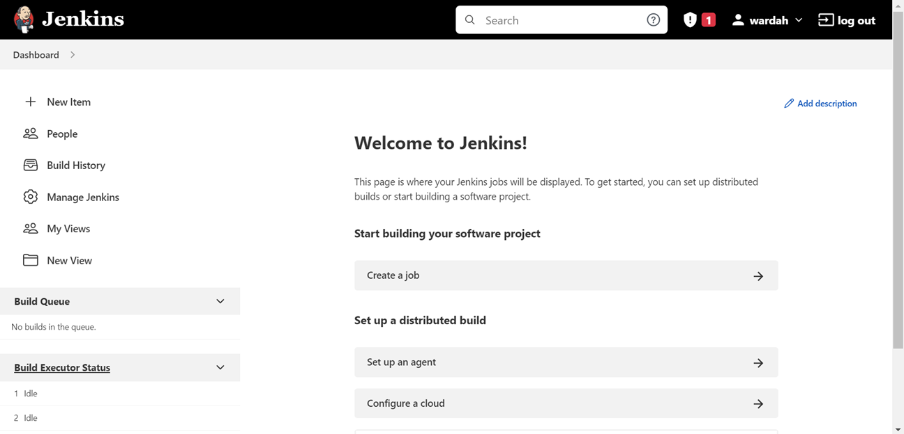</br>

### Selenium WebDriver Project

- In the project folder, create the `lib` folder.
- Add all JARs files in this folder `lib`.
- Create `bat` File in the project Folder.
- the `bat` file content:

```bat
cd C:\Users\white\eclipse-workspace\DatabaseTestingUsingSelenium
set ProjectPath=C:\Users\white\eclipse-workspace\DatabaseTestingUsingSelenium
echo %ProjectPath%
set classpath=%ProjectPath%\bin;%ProjectPath%\lib\*
echo %classpath%
java org.testng.TestNG %ProjectPath%\testng.xml
```

### Jenkin Dashboard is Ready
- Click on `New Item`
- Enter a Project name
- Click on `Freestyle Project`

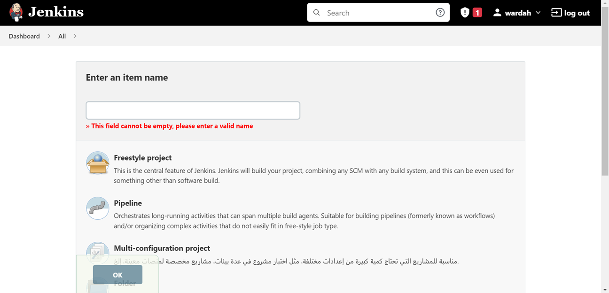</br>

- Advanced > Use custom workspace.
- Enter the project path.

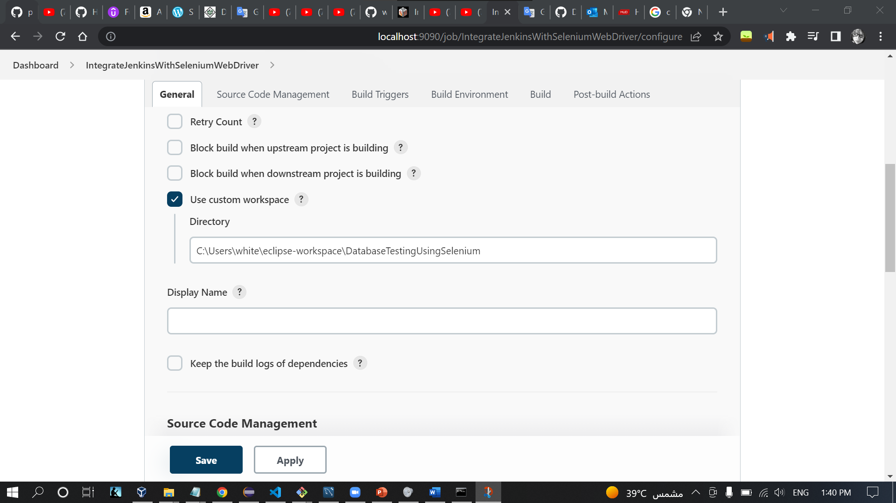</br>

- Build > Execute Windows batch command > Click on Apply

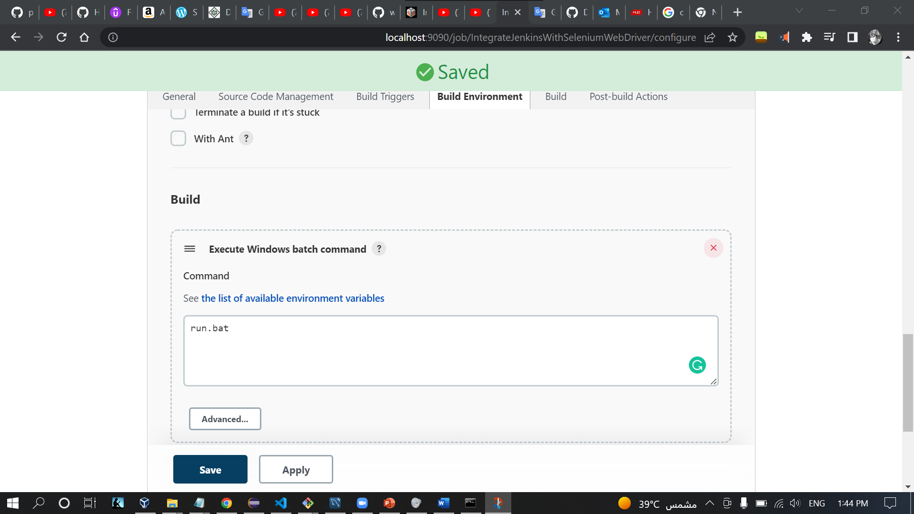</br>

- Click on Save

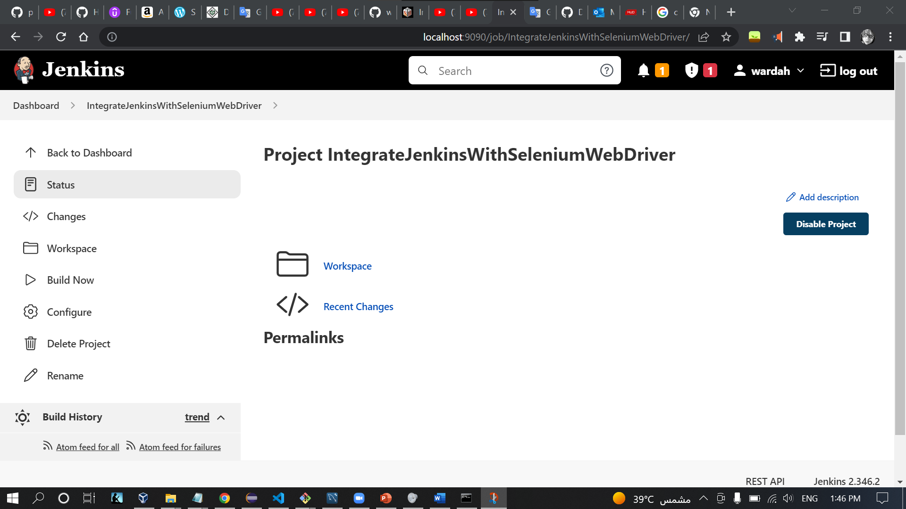</br>

- Click on Build Now

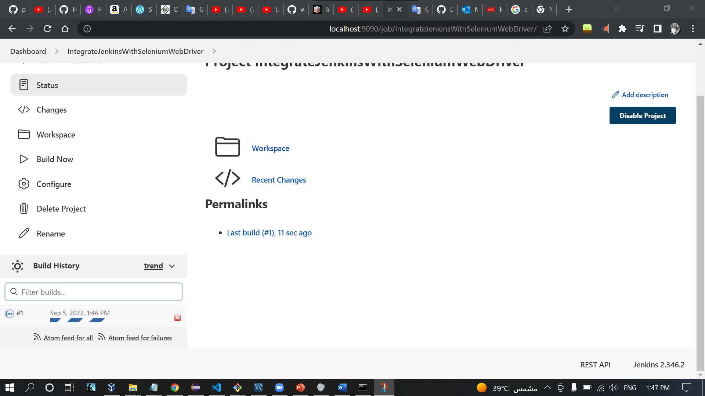</br>


