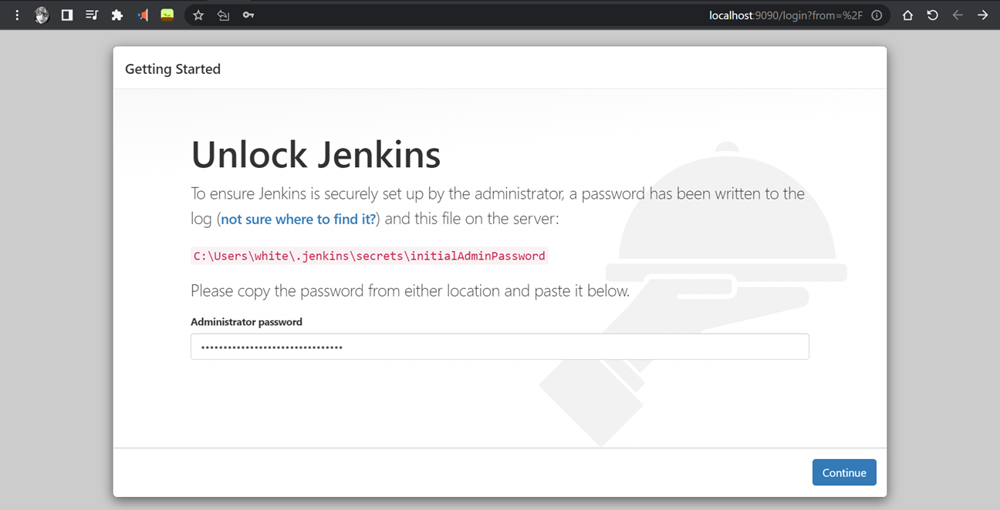

## Continuous integration: Integrate Jenkins With Selenium WebDriver 

- Setup Jenkins in your local Machine
    - Download and Install Jenkins, https://www.jenkins.io/download/
    - Open `CMD`
    - Run `Java -version`, to check if java is Installed Successfully.
    - Run `java -jar jenkins.war`
    - If you are getting any errors try this command: `java -jar jenkins.war --enable-future-java --httpPort=9090`
    - Save the password.

 

- Open the browser: http://localhost:9090/
- Enter the password and click continue

 

- Click Install Suggested plugins

 

- Fill in the Details

 
 
 
 

### Jenkin Dashboard is Ready
- Click on `New Item`
- Click on `Freestyle Project`

 

