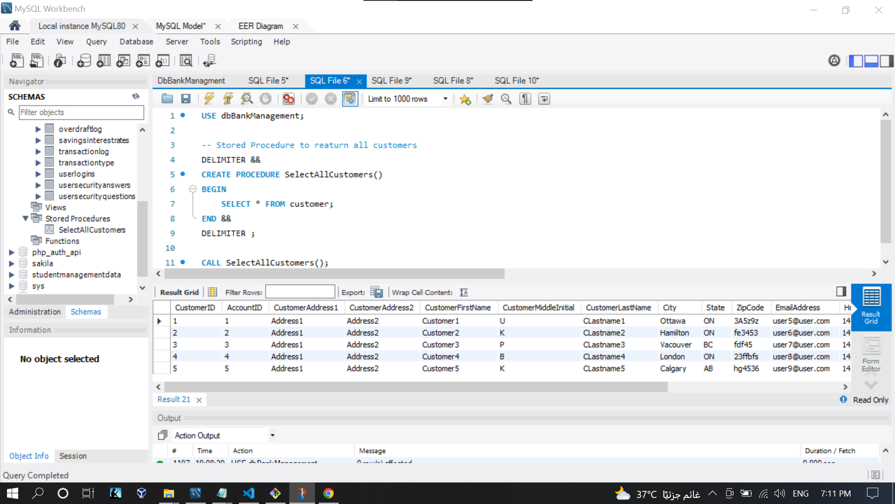
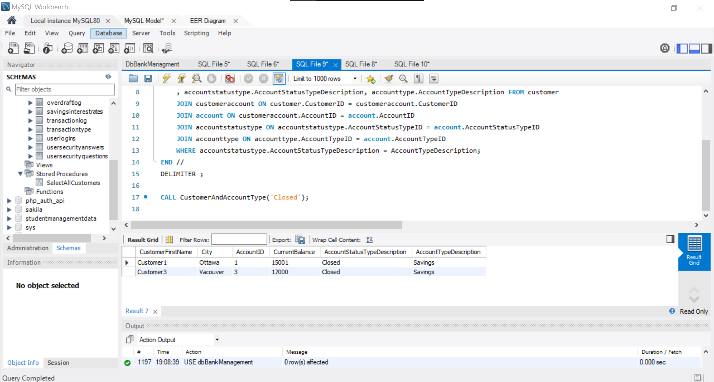
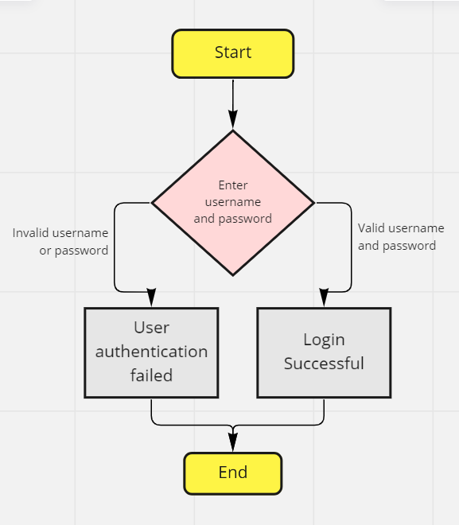
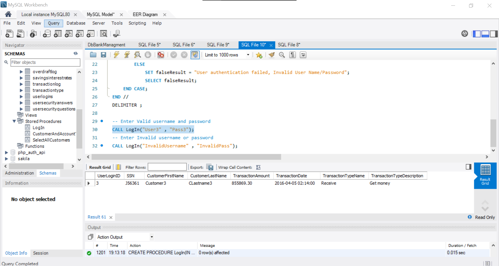
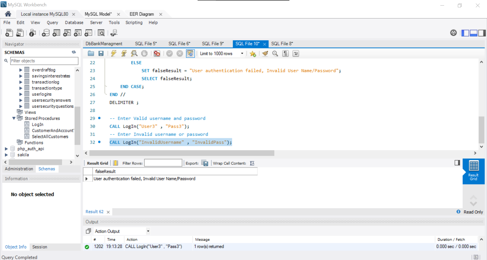

## Stored Procedure 1:
- <b>Stored procedure Name:</b> SelectAllCustomers.
- <b>Description:</b> Stored Procedure SELECT all customers
- <b>Input Parameters:</b> NA
- <b>Output Parameters:</b> NA

```sql
USE dbBankManagement;
-- Stored Procedure SELECT all customers
DELIMITER && CREATE PROCEDURE SelectAllCustomers() BEGIN
SELECT *
FROM customer;
END && DELIMITER;
CALL SelectAllCustomers();
```
</br>

## Stored Procedure 2:
- <b>Stored procedure Name:</b> CustomerAndAccountType
- <b>Description:</b> Stored Procedure SELECT customers Information based on their `AccountStatusTypeDescription` status  in `accountstatustype` table.
- <b>Input Parameters:</b> IN AccountTypeDescription varchar(30)
- <b>Output Parameters:</b> NA

```sql
USE dbBankManagement;
-- Stored Procedure SELECT customers Information 
-- based on their `AccountStatusTypeDescription` status  in `accountstatustype` table.
DELIMITER / / CREATE PROCEDURE CustomerAndAccountType(IN AccountTypeDescription varchar(30)) BEGIN
SELECT customer.CustomerFirstName,
    customer.City,
    customer.AccountID,
    account.CurrentBalance,
    accountstatustype.AccountStatusTypeDescription,
    accounttype.AccountTypeDescription
FROM customer
    JOIN customeraccount ON customer.CustomerID = customeraccount.CustomerID
    JOIN account ON customeraccount.AccountID = account.AccountID
    JOIN accountstatustype ON accountstatustype.AccountStatusTypeID = account.AccountStatusTypeID
    JOIN accounttype ON accounttype.AccountTypeID = account.AccountTypeID
WHERE accountstatustype.AccountStatusTypeDescription = AccountTypeDescription;
END / / DELIMITER;
CALL CustomerAndAccountType('Closed');

```
</br>

## Stored Procedure 3:
- <b>Stored procedure Name:</b> LogIn
- <b>Description:</b> Stored Procedure SELECT Customer and Transaction Information After Successful Login, Or Error MESSAGE After entering Invalid Data.
- <b>Input Parameters:</b> (IN User varchar(50) , IN Password varchar(20))
- <b>Output Parameters:</b> NA

</br>

```sql
USE dbBankManagement;
-- Stored Procedure SELECT Customer and Transaction Information After Successful Login, 
-- Or Error MESSAGE After entering Invalid Data
DELIMITER / / CREATE PROCEDURE LogIn(IN User varchar(50), IN Password varchar(20)) BEGIN
DECLARE sqlStatment boolean;
DECLARE falseResult varchar(100);
SELECT UserLoginID INTO sqlStatment
FROM userlogins
WHERE userlogins.UserLogin = User
    AND userlogins.UserPassword = Password;
CASE
    sqlStatment
    WHEN sqlStatment THEN
    SELECT userlogins.UserLoginID,
        customer.SSN,
        customer.CustomerFirstName,
        customer.CustomerLastName,
        transactionlog.TransactionAmount,
        transactionlog.TransactionDate,
        transactiontype.TransactionTypeName,
        transactiontype.TransactionTypeDescription
    FROM userlogins
        Join transactionlog ON transactionlog.UserLoginID = userlogins.UserLoginID
        Join transactiontype ON transactiontype.TransactionTypeID = transactionlog.TransactionTypeID
        Join customer ON customer.CustomerID = transactionlog.CustomerID
    WHERE UserLogin = User
        AND UserPassword = Password;
ELSE
SET falseResult = "User authentication failed, Invalid User Name/Password";
SELECT falseResult;
END CASE
;
END / / DELIMITER;
-- Enter Valid username and password 
CALL LogIn("User3", "Pass3");
-- Enter Invalid username or password
CALL LogIn("InvalidUsername", "InvalidPass");
```
### Enter Valid username and password:
</br>

### Enter Invalid username or password
</br>


<!-- ### Stored Procedure 3:
- <b>Stored procedure Name:</b>
- <b>Description:</b>
- <b>Input Parameters:</b>
- <b>Output Parameters:</b>

```sql
```
</br> -->